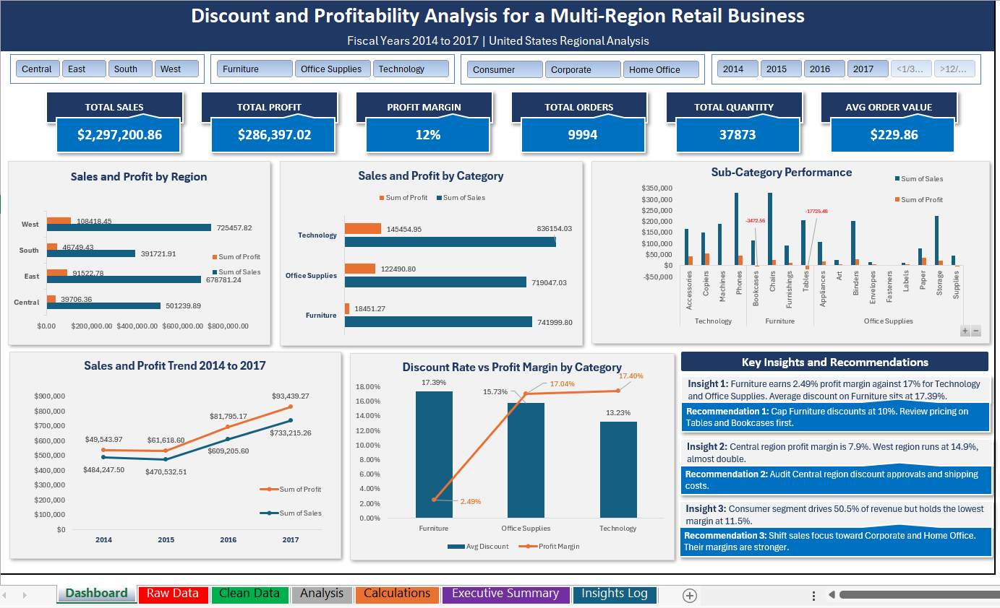
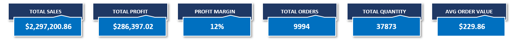
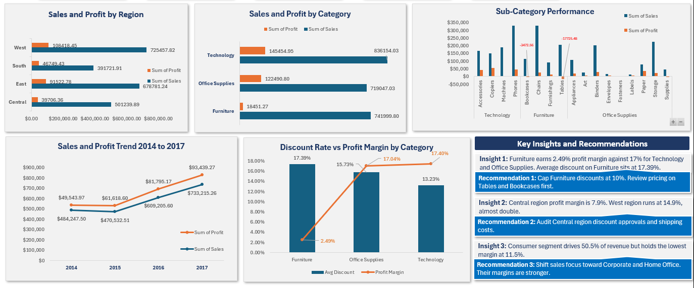
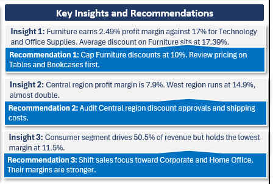
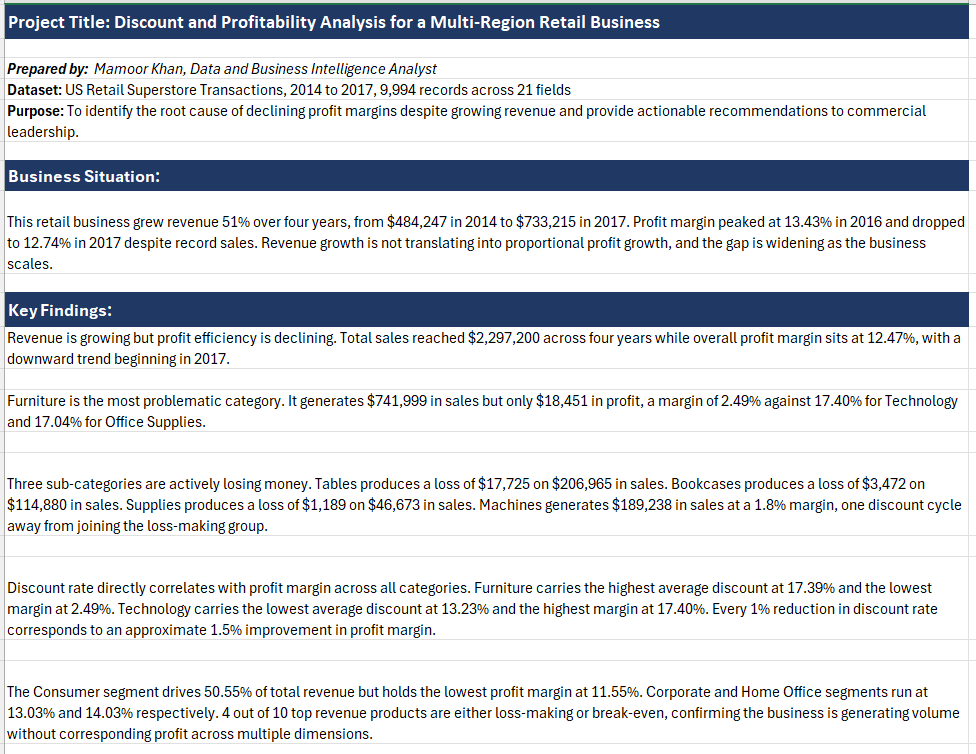

# Discount and Profitability Analysis for a Multi-Region Retail Business

**Prepared by:** Mamoor Khan, Data and Business Intelligence Analyst
**Tool:** Microsoft Excel
**Dataset:** US Retail Superstore Transactions, 2014 to 2017, 9,994 orders across 21 fields

---

## Project Summary

This project investigates why a US retail business grew revenue 51% over four years while profit margins declined. Using four years of transaction data covering 9,994 orders across four regions, three product categories, and three customer segments, the analysis identifies aggressive discounting as the primary driver of margin erosion. Furniture, the second-highest revenue category, generates a 2.49% profit margin against 17.40% for Technology, directly linked to a 17.39% average discount rate, the highest of any category.

---

---

## Business Problem

The business recorded $2,297,200 in total sales between 2014 and 2017 with an overall profit margin of 12.47%. Despite consistent revenue growth, profit margin peaked at 13.43% in 2016 and dropped to 12.74% in 2017. Leadership needed to understand which product lines, regions, and customer segments were driving this decline and what commercial decisions were causing it.

---

---

## Business Questions

This analysis was built to answer six specific business questions.

1. Which region generates the most revenue, and which has the lowest profit margin?
2. Which product category is driving profit loss despite strong sales volume?
3. Which specific sub-categories are actively losing money?
4. What is the relationship between discount rate and profit margin across categories?
5. Which customer segment is most profitable, and which is over-discounted?
6. Is the business growing in profit efficiency or just in revenue volume?

---

## Key Findings

- Profit margin declined from 13.43% in 2016 to 12.74% in 2017 despite revenue reaching a four-year high of $733,215. Revenue growth is not translating into proportional profit growth.

- Furniture generates $741,999 in sales but only $18,451 in profit, a margin of 2.49% against 17.40% for Technology and 17.04% for Office Supplies. It is the most damaging category in the portfolio.

- Three sub-categories generate active losses. Tables at -$17,725 on $206,965 in sales. Bookcases at -$3,472 on $114,880 in sales. Supplies at -$1,189 on $46,673 in sales. Machines sits at 1.8% margin, one discount cycle away from joining this group.

- Discount rate directly correlates with profit margin across all categories. Furniture carries the highest average discount at 17.39% and the lowest margin at 2.49%. Technology carries the lowest average discount at 13.23% and the highest margin at 17.40%. Every 1% reduction in discount rate corresponds to an approximate 1.5% improvement in profit margin.

- The Consumer segment drives 50.55% of total revenue but holds the lowest margin at 11.55%. Corporate and Home Office segments run at 13.03% and 14.03% respectively, confirming the business is over-discounting to win Consumer volume at the cost of margin.

---

---

## Recommendations

1. Cap discounts on Furniture products at 10% immediately, with specific pricing reviews on Tables and Bookcases, the two sub-categories generating active losses.

2. Audit the discount approval process in the Central region, where profit margin sits at 7.9% against a company average of 12.47%, to identify where management authorizes excess discounts.

3. Shift commercial focus and marketing investment toward Corporate and Home Office segments, where profit margins of 13.03% and 14.03% demonstrate stronger return per dollar of revenue than the Consumer segment at 11.55%.

---

---

## Methodology

Data was imported using Power Query to enforce correct data types across all 21 fields before any analysis began. Seven Pivot Tables were built to cover performance by Region, Category, Sub-Category, Customer Segment, Year, Top Products, and Discount Impact. AVERAGEIF formulas calculated average discount rates by category from 9,994 raw transaction rows. Every metric on the dashboard updates in real time when slicers are applied, powered by GETPIVOTDATA formulas in a dedicated Calculations sheet. Findings were documented in a structured Insights Log and translated into a written Executive Summary for non-technical leadership.

---

## Tools and Techniques

- **Tool:** Microsoft Excel
- **Data Import:** Power Query with enforced data type correction across 21 fields
- **Analysis:** Pivot Tables, GETPIVOTDATA, AVERAGEIF, SUMIFS, COUNTIF, IFERROR
- **Dashboard:** Shapes for KPI cards, Clustered Bar Charts, Line Chart, Combo Chart, connected Slicers via Report Connections
- **Reporting:** Written Executive Summary formatted for non-technical leadership

---

## Dataset

Sample Superstore, US retail transaction data covering 9,994 orders from 2014 to 2017. Source: Kaggle. File included in this repository as Sample_Superstore.csv.

Original dataset available at: [Kaggle Superstore Dataset](https://www.kaggle.com/datasets/vivek468/superstore-dataset-final)

---

## File Structure

| Sheet | Purpose |
|---|---|
| Dashboard | Fully interactive one-page executive dashboard with six KPI cards, five charts, Sub-Category performance table, four slicers, and Key Insights panel |
| Raw Data | Original dataset, 9,994 rows across 21 columns, protected and untouched after import |
| Clean Data | Working copy with corrected data types, zero blanks, zero duplicates, and Profit Margin column added |
| Analysis | Seven Pivot Tables covering all analytical dimensions with Profit Margin columns added |
| Calculations | Single formula engine using GETPIVOTDATA and AVERAGEIF formulas feeding all dashboard metrics dynamically |
| Executive Summary | Written business report covering situation, five key findings, root cause, three recommendations, and expected impact |
| Insights Log | Complete analytical thinking trail documenting every finding across six dimensions |

---

## How to Use the Dashboard

Open the Dashboard sheet first. Use the Region, Category, Segment, and Year slicers at the top to filter the entire dashboard, including all six KPI cards and all five charts simultaneously. Each chart answers a specific business question. The Sales and Profit by Region chart identifies your strongest and weakest geographic markets. The Sales and Profit by Category chart shows where margin problems exist at the product level. The Sub-Category Performance chart flags loss-making product lines in red. The Sales and Profit Trend chart shows a four-year trajectory of revenue and profit. The Discount Rate vs. Profit Margin Combo Chart demonstrates the direct relationship between discounting behavior and profitability outcomes. Read the Key Insights and Recommendations panel on the right for the three most actionable findings from this analysis.

---

---

## About the Analyst

Mamoor Khan is a Data and Business Intelligence Analyst based in Peshawar, Pakistan. He builds ETL pipelines and interactive dashboards that translate complex data into clear, actionable insights. His work supports strategic decision-making, surfaces efficiency gaps, and identifies growth signals through rigorous data analysis.

**Education:** BS Computer Science, University of Peshawar, CGPA 3.64 out of 4.0

**Certifications:**
- Microsoft Certified: Data Analyst Associate, May 2026
- Google Data Analytics Professional Certificate, In Progress
- Data Analytics and Business Intelligence, DigiSkills, March 2026
- Introduction to Data Analytics, Simplilearn, February 2026
- AI for Business Professionals, HP LIFE, January 2026

**Connect:**
- LinkedIn: https://www.linkedin.com/in/mamoor-khan/
- GitHub: https://github.com/mamoorkhann
